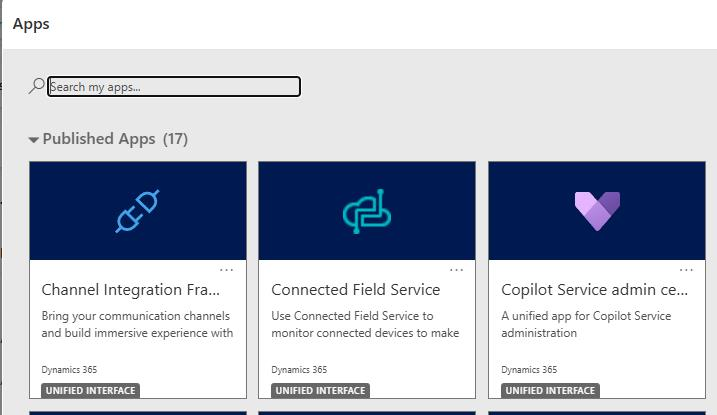
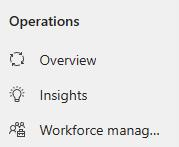
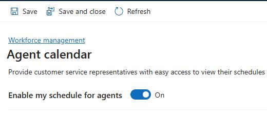
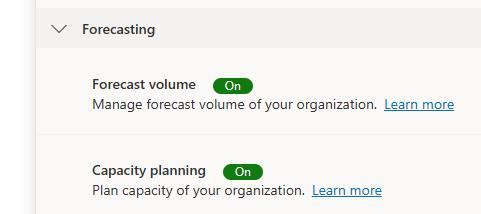
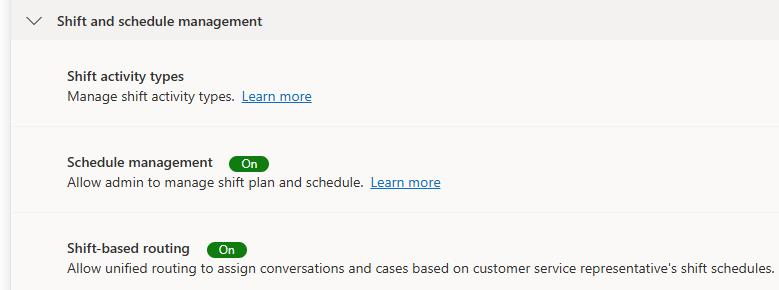
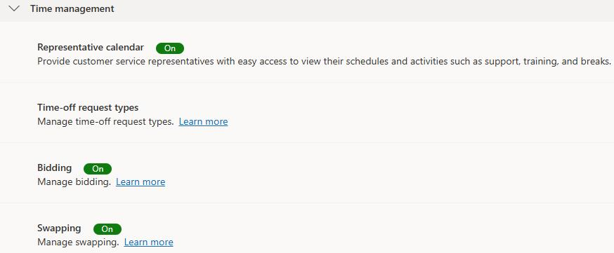

## Task 01: Enable Workforce management options

### Introduction

Contoso can't move from manual scheduling to AI-driven planning until Workforce Management capabilities are enabled across forecasting, scheduling, and agent self-service.

### Description

In this task, you turn on the Workforce Management features required for forecasting, capacity planning, schedule management, shift-based routing, and agent self-service capabilities like bidding and swapping.

### Success criteria
- Workforce Management features are enabled and available for configuration and use across forecasting, planning, scheduling, and self-service.

### Key steps

1. In Edge, go to Dynamics 365. The URL should resemble **https://org6e56877e.crm.dynamics.com/**.

1. If prompted, sign in by using the administrator credentials for your demo environment.

1. On the **Published Apps** page, select **Copilot Service admin center**.

    

1. In the left pane, In the **Operations** section, select **Workforce management**.

    

1. In the **Time management** section, locate the **Representative calendar** option and select **Manage**.

    

1. Set **Enable my schedule for agents** to **On**.

    

1. On the command bar, select **Save and Close**.

1. In the **Forecasting** section, turn on the following feature:
    
    - Capacity planning
    
    
    
1. In the **Shift and schedule management** section, turn on the following features:

    - Capacity planning
    - Schedule management
    - Shift-based routing

    

1. In the **Time management** section, turn on the following features:

    - Representative calendar
    - Bidding
    - Swapping
    
    