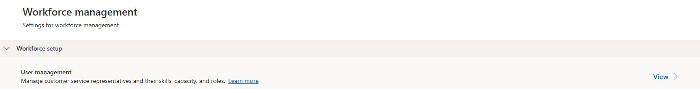
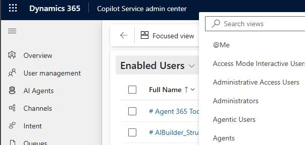
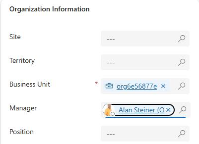
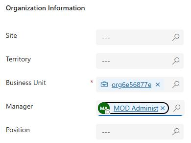

## Task 02: Assign managers

### Introduction

Shift swaps, bidding, and time-off requests require clear reporting relationships so approvals and accountability work at scale across Contoso's global support team.

### Description

In this task, you assign managers to agents so requests such as time off, swaps, and bids can follow an approval path and support better workforce visibility.

### Success criteria

Managers are assigned to the required users so shift and time-off workflows can be submitted and approved.

### Key steps

1. In **Copilot Service admin center**, in the left pane, select **Workforce Management**.

    
    

1. In the **User Management** section, select **View**.

    

1. Locate **Users** and then select **Manage**.

    

1. Select **Enabled Users** and then select **Agents** to change the view.

    
    
1. Select your administrative account.

    
    
1. Select the **Summary** tab. On the right side of the page, on the **Organization Information** tile, in the **Manager** field, set the value to **Alan Steiner**.

    

1. On the command bar, select **Save and Close**.

    

1. In the list of agents, select the **Alex Baker** record. On the **Organization Information** tile, in the **Manager** field, set the value to  your administrative account.

    

1. Repeat Step 8 to assign your administrative account as the **Manager** for the following users:

    - Alicia Thomber
    - Amy Alberts
    - Anita Montero
    - Benjamin Mcphee
    - David Mallory
    - Molly Clark
    - Nancy Warner
    - Renee Lo
    - Spencer Low
