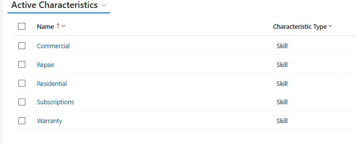

## Task 03: Create skills and proficiency levels

### Introduction

Contoso's staffing challenges worsen when the wrong skills are scheduled against the wrong demand, especially during seasonal surges and product launches.

### Description
In this task, you'll create the skill framework (for example, Commercial, Residential, Subscriptions, Warranty, Repair) that will be used for forecasting, routing, and schedule optimization.

### Success criteria

The required skills are created and available to assign to customer service representatives.

### Key steps

1. In **Copilot Service admin center**, in the left pane, select **Workforce Management**.

    
    

1. In **User management**, select **View.**

1. In **Skills hub**, select **Manage**.

1. On the **Skills** page, select **Create**.

1. Configure the **Characteristic** as follows:

     - **Skill Name:** Commercial
     - **Skill Type:** Skill
   

1. Select **Save and Close**.

1. Repeat the steps above to add the following skills:

    | Name | Type |
    | -------- | -------- |
    | Residential    |Skill  |
    | Subscriptions    |  Skill|
    | Warranty    | Skill |
    | Repair    | Skill |

1. Your completed skills should resemble the image below (you may have more skills in the list if they existed from before):

    