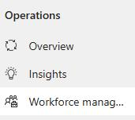
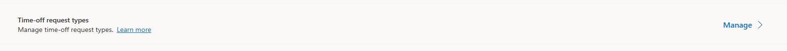
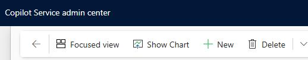
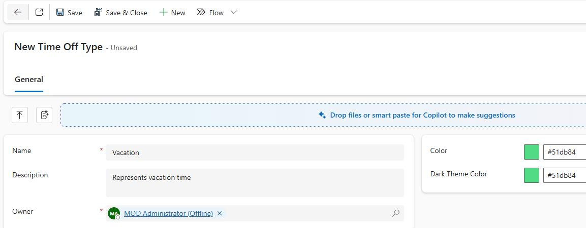

## Task 05: Create time-off request types

### Introduction
High turnover and burnout are often driven by inflexible scheduling, so Contoso needs a consistent way for agents to request time off within the same system used for staffing.

### Description
In this task, you'll create time-off request types (Vacation, PTO, Unpaid, Sick Leave) so agents can submit requests and supervisors can manage coverage impacts.

### Success criteria
- Time-off request types are created and available for agents to use in self-service workflows.

### Key steps

1. In **Copilot Service admin center**, in the left pane, select **Workforce Management**.

	
	

1. In the **Time management** section, select **View**.

1. In the **Time management** group, locate **Time-off request types** and select **Manage**.

	
	
1. On the command bar, select **+ New**.

	

1. Configure the **Time-off Activity** type as follows:

    - **Name:** Vacation
    - **Description:** Represents Vacation time
    - **Color:** #51db84
    - **Dark theme Color:** #51db84

    

1. On the command bar, select **Save and Close**.

	
1. Repeat Steps 4 through 6 to add the following time-off types:

    | Name  | Description  | Color  | Dark Color  |
    | -------- | -------- | -------- | -------- |
    | PTO  | Represents Paid time Off | #7451db | #7451db |
    | Unpaid | Represents unpaid time off | #db51c2 | #db51c2 |
    | Sick Leave | Represents extended sick leave | #db9651 | #db9651 |