## Task 06: Configure queues

### Introduction
To align staffing with demand in real time, Contoso needs routing that respects who is scheduled, skilled, available, and actively working.

### Description
In this task, you'll create a queue and configure shift-based routing rules so incoming work can be assigned to agents based on skills, presence, capacity, and calendar schedule.

### Success criteria
A queue and shift-based routing ruleset are configured so work can be routed to scheduled, qualified, available agents.

### Key steps

1. Open **Copilot Service admin center**.

1. In the left pane, in the **Customer support** section, select **Queues**.

    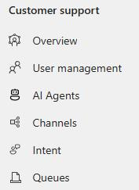
    
1. Locate **Advanced Queues** and then select **Manage**.

    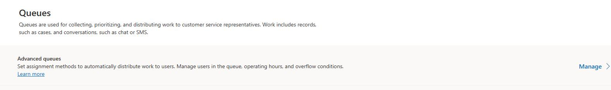

1. On the command bar, select **+ New queue**.

    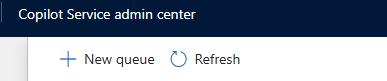

1. Configure the queue as follows and then select **Create**:

    - **Name:** Shift Based Routing
    - **Type:** Messaging
    - **Queue Priority:** 10

    {; .important }
    > Unified routing prioritizes a queue with a smaller number over a queue with a larger number.

    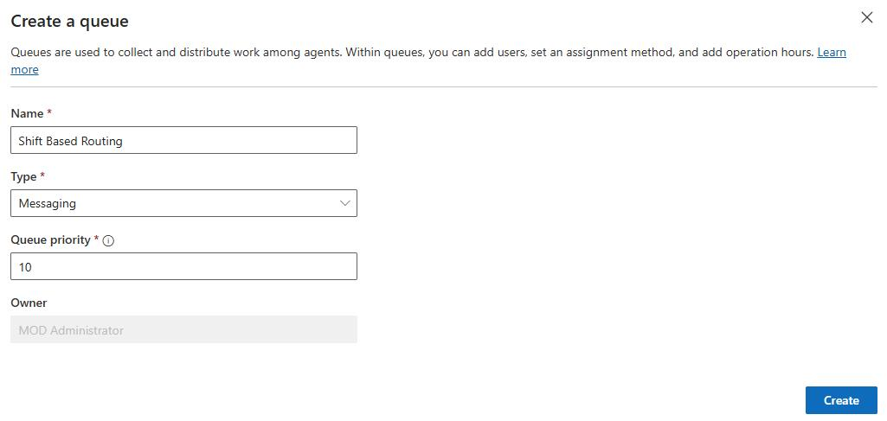
    

1. On the **Shift Based Routing** page, on the **Add Users to this Queue** tile, select **+ Add users**.

    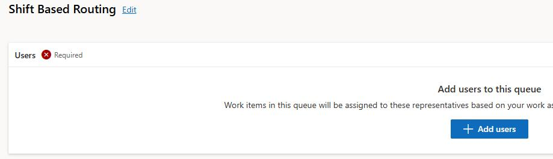

1. Select the following users and then select **Add**:

    - Alan Steiner
    - Alex Baker
    - Alicia Thomber
    - Amy Alberts
    - Anita Montero
    - Benjamin Mcphee
    - David Mallory
    - Molly Clark
    - Nancy Warner
    - Renee Lo
    - Spencer Low

    
1. On the **Shift Based Routing** page, on the **Assignment method** tile, select **See more**.

    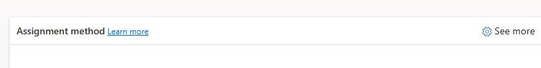

1. Select **Create new**.

    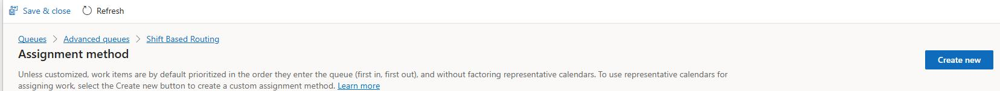
    
1. In the **Create work assignment** dialog, in the **Name** field, enter `Shift routing` and then select **Create**.

    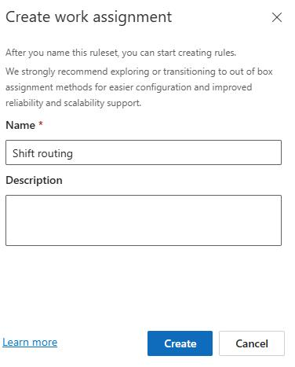

1. On the **Assignment rulesets** tile, select **Create Ruleset**.

    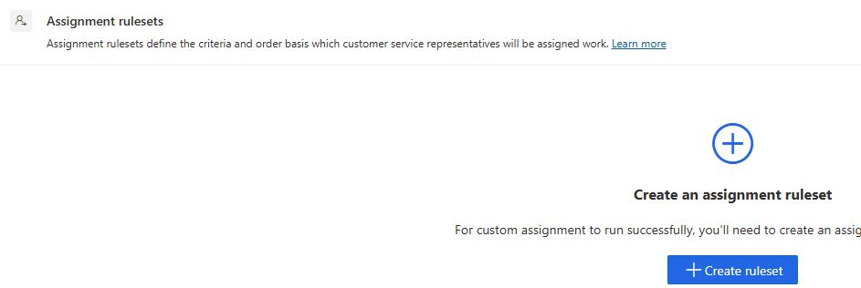

1. Select **+ New Ruleset**.

1. In the **Ruleset** name field, enter `Route reps` and then select **Create**.

    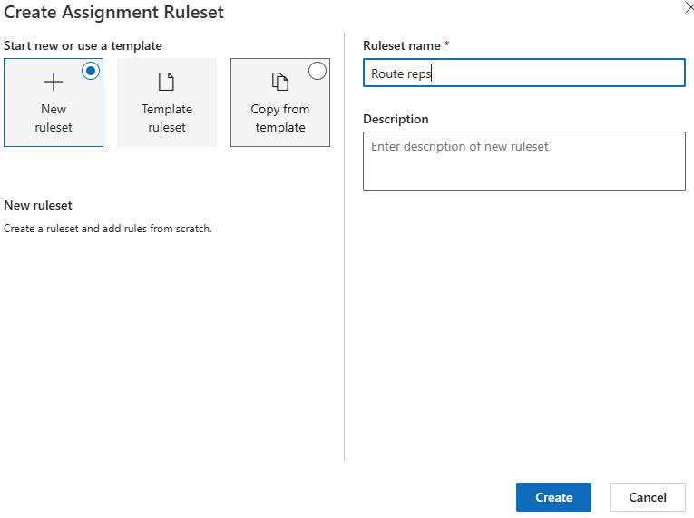

1. On the **Decision List** tile, select **Create Rule**.

    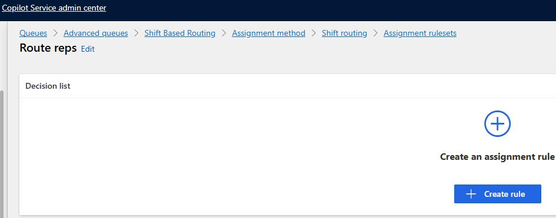

1. In the **Rule Name** field, enter `Shift routing demo`.

1. Configure the conditions as follows:

    - **User skills** > **Exact match** > **All skills**

    - **Presence status** > **Equals** > **Dynamic Match** > **Conversation** . **Workstream** . **Allowed Presences**

    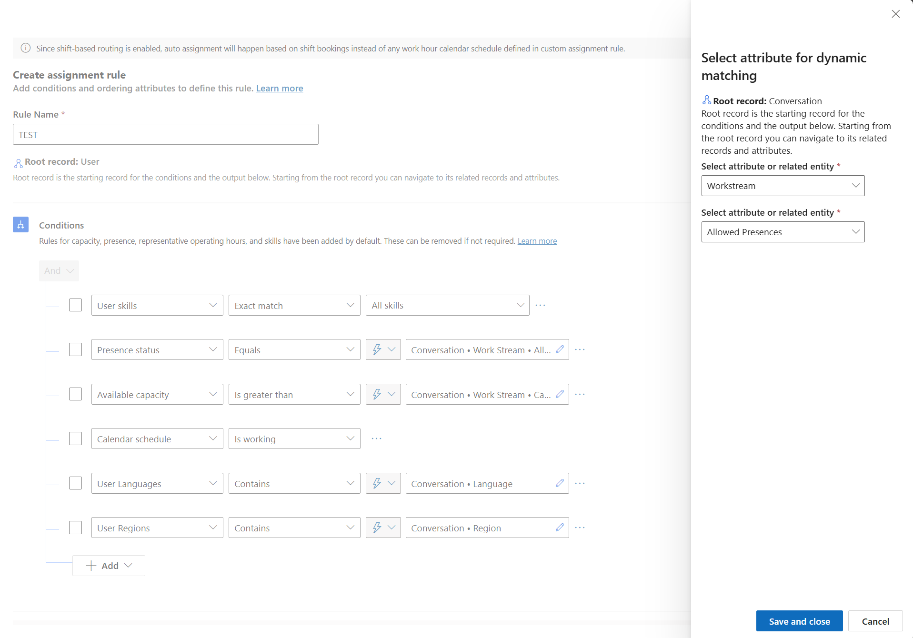

    - **Available capacity** **> Is greater than** > **Dynamic Match** > **Conversation** . **Workstream** . **Capacity**

    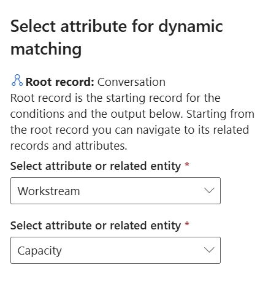

    - **Calendar schedule** > **is working**

    {: .note }
    > Remove any additional conditions (ex. User Languages - User Regions)

1. In the **Order by** field, select **Least Active**.

    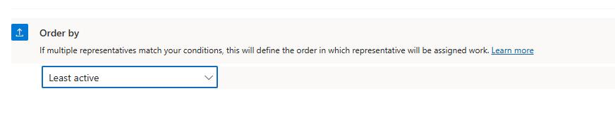

1. Select **Create**.