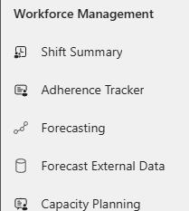
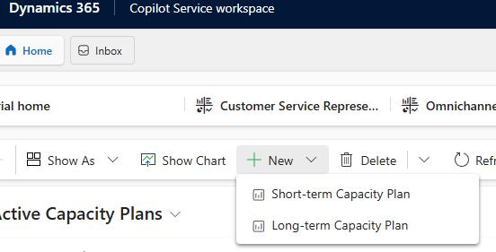
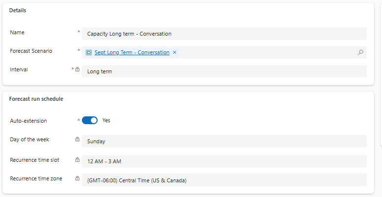
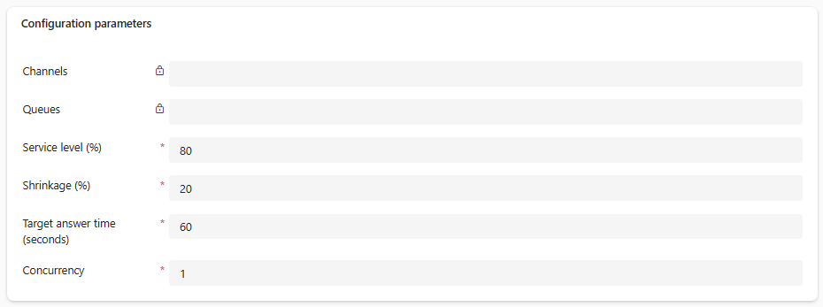
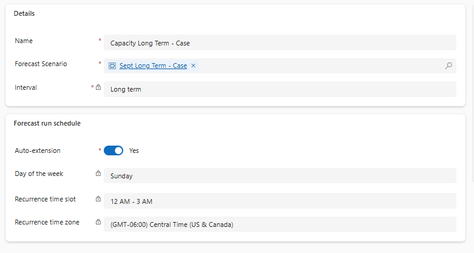
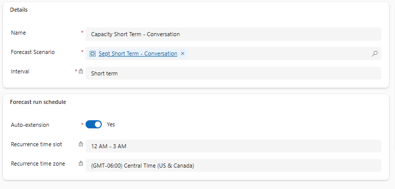
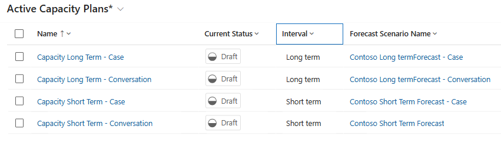

## Task 01: Create capacity plans

### Introduction
Forecasts help Contoso predict demand, but they still need a clear staffing plan that accounts for service-level goals, shrinkage, and workload patterns across channels. Capacity plans translate forecasted volume into required staffing so Contoso can reduce wait times, control overtime, and avoid burnout.

### Description
In this task, you'll create long-term and short-term capacity plans for both conversations and cases by selecting the appropriate forecast scenarios, configuring the run schedule, and setting key planning parameters such as service level, shrinkage, target answer time, and concurrency.

### Success criteria
- Long-term and short-term capacity plans for conversations and cases are created and saved using the correct forecast scenarios and planning parameters.

### Key steps

{: .warning }
> The capacity plans that you create here rely on the forecasts that you created in the prerequisites lab. You will not be able to select entries for the **Forecast Scenario** field if the forecasts were not created.

---

#### 01: Create a long-term capacity plan for conversations
1. Open the **Copilot Service workspace** app (not **Copilot Service admin center**).

    

1. In the left pane, in the **Workforce Management** section, select **Capacity Planning**.

    

1. Select **+ New** and then select **Long-Term Capacity Plan**.

    

1. Configure the plan as follows:

    - **Details** tile

        - **Name:** Capacity Long term - Conversation
        - **Forecast Scenario:** Sept Long Term - Conversation
        - **Interval:** Long term

    - **Forecast run schedule** tile

        - **Auto-extension:** Yes
        - **Day of the week:** Sunday
        - **Recurrence time slot:** 12 AM - 3 AM
        - **Recurrence time zone:** Select your time zone

    

    - **Configuration parameters** tile

        - **Service level (%):** 80
        - **Shrinkage:** 20
        - **Target answer time:** 60
        - **Concurrency:** 1

    

1. Select **Save and Close**.

---

#### 02: Create a long-term capacity plan for cases
1. Select **+ New** and then select **Long-Term Capacity Plan**.

    

1. Configure the plan as follows:

    - **Details** tile

        - **Name:** Capacity Long term - Case
        - **Forecast Scenario:** Sept Long-term - Case
        - **Interval:** Long term

    - **Forecast run schedule** tile

        - **Auto-extension:** Yes
        - **Day of the week:** Sunday
        - **Recurrence time slot:** 12 AM - 3 AM
        - **Recurrence time zone:** Select your time zone

        

    - **Configuration parameters** tile

        - **Service level (%):** 80
        - **Shrinkage:** 20
        - **Target answer time:** 60
        - **Concurrency:** 1

        

1. Select **Save and Close**.

---

#### 03: Create a short-term capacity plan for conversations

1. Select **+ New** and then select **Short-Term Capacity Plan**.

1. Configure the plan as follows:

    - **Details** tile

        - **Name:** Capacity Short term - Conversation
        - **Forecast Scenario**: Sept Short Term - Conversation
        - **Interval:** Short term

    - **Forecast run schedule** tile

        - **Auto-extension:** Yes
        - **Recurrence time slot:** 12 AM - 3 AM
        - **Recurrence time zone:** Select your time zone

    

    - **Configuration parameters** tile

        - **Service level (%):** 80
        - **Shrinkage:** 20
        - **Target answer time:** 60
        - **Concurrency:** 1

    

1. Select **Save and Close**.

---

#### 04: Create a short-term capacity plan for cases
1. Select **+ New** and then select **Short-Term Capacity Plan**.

1. Configure the plan as follows:

    - **Details** tile

        - **Name:** Capacity Short term - Case
        - **Forecast Scenario**: Sept Short Term - Case
        - **Interval:** Short Term

    - **Forecast run schedule** tile

        - **Auto-extension:** Yes
        - **Recurrence time slot:** 12 AM - 3 AM
        - **Recurrence time zone:** Select your time zone

    - **Configuration parameters** tile

        - **Service level (%):** 80
        - **Shrinkage:** 20
        - **Target answer time:** 60
        - **Concurrency:** 1

    - Select **Save and Close**.

1. Your completed capacity plans should resemble the image below:

    
