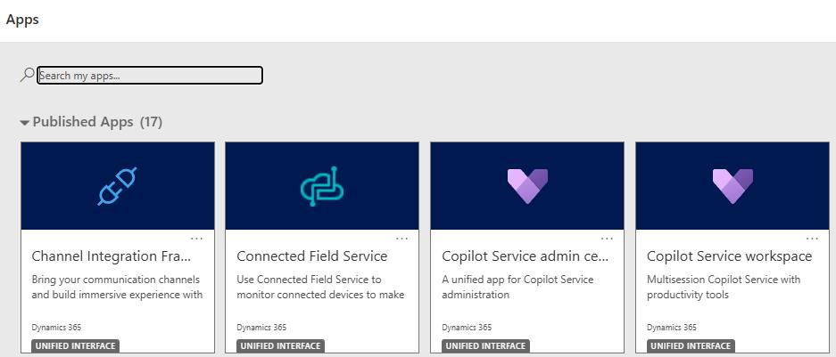
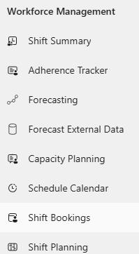
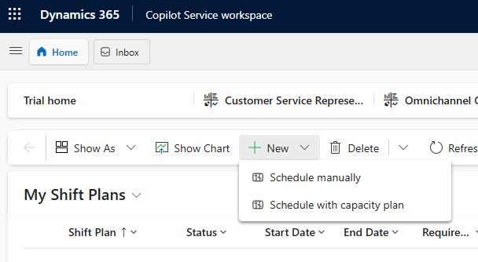
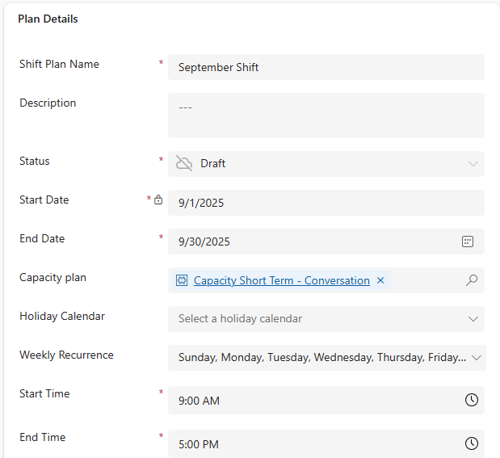
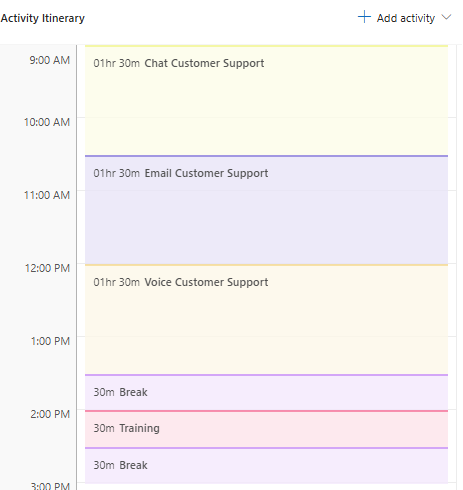
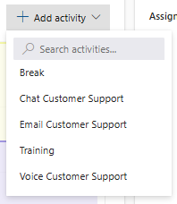
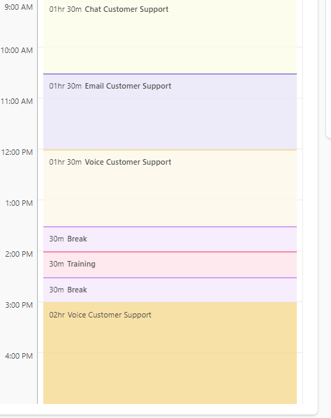

## Task 01: Create a shift plan

### Introduction
Contoso needs a repeatable "shift blueprint" that reflects real work patterns across the day, instead of relying on ad-hoc manual schedules that miss breaks, training, and channel coverage needs.

### Description
In this task, you'll create a shift plan tied to a capacity plan, define the date range and working hours, and build an activity itinerary that includes support activities, breaks, and training.

### Success criteria
- A shift plan is created and saved with the correct date range, hours, capacity plan, and activity itinerary.

### Key steps
1. Open the **Copilot Service workspace** app (not **Copilot Service admin center**).

    

1. In the left pane, in the **Workforce Management** section, select **Shift Planning**.

    

1. On the command bar, select **+ New** and then select **Schedule with capacity plan.**

    

1. Configure the **Plan Details** tile by using the following information:

    {: .warning }
    > Once you save the shift plan, you can't change the start time, end time, or time zone.

    - **Shift Plan Name**: "Current Month Name" Shifts - Ex. Sept Shifts
    - **Start Date**: 1st day of the current month - Ex. 9/1/2025
    - **End Date**: Last day of the current month - Ex. 9/30/2025
    - **Capacity Plan:** Capacity Short Term Conversation
    - **Weekly Recurrence:** Sunday - Saturday (select all days)
    - **Start time**: 9:00 AM 
    - **End time**: 5:00 PM 
    - **Time zone**: Select your time zone. 

    

1. Select **Save**.

1. On the **Activity Itinerary** panel in the middle of the screen, select **Add Activity**.

1. From the menu that appears, select **Chat Customer Support 1 (hr) 30 (min)**.

1. Repeat Steps 6 and 7 to add the following activities:

    {: .warning }
    > It is important that you add the activities in the order listed.

    - Email Customer Support 1 (hr) 30 (min)
    - Voice Customer Support 1 (hr) 30 (min)
    - Break 30 (min)
    - Training 30 (min)
    - Break	30 (min)

    

1. After the 30 min break, select **Add Activity**. From the menu that appears, select **Voice Customer Support**.

    

1. Change the duration **two hours**.

1. Your completed shift plan should resemble the image below.

    

1. Select **Save**.

1. Leave the shift plan open.
