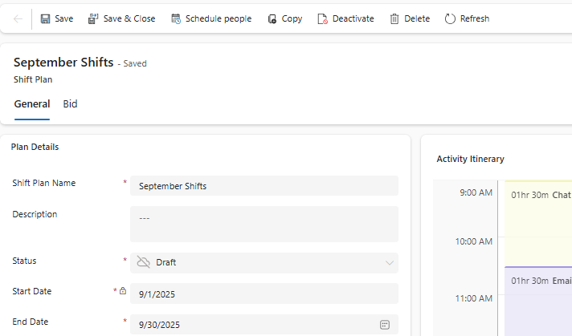
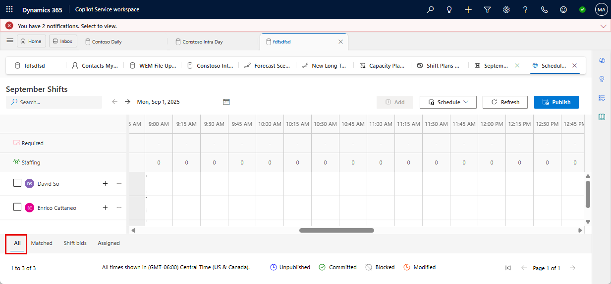
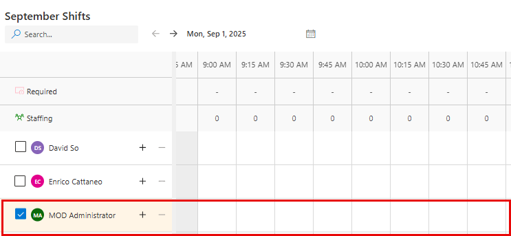
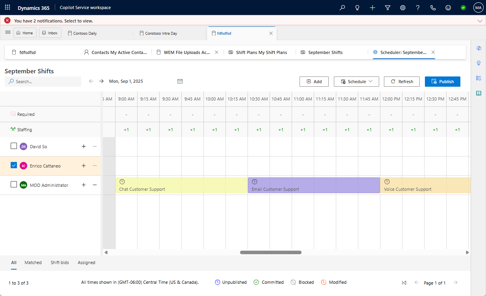
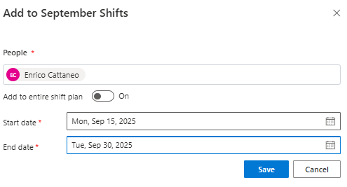
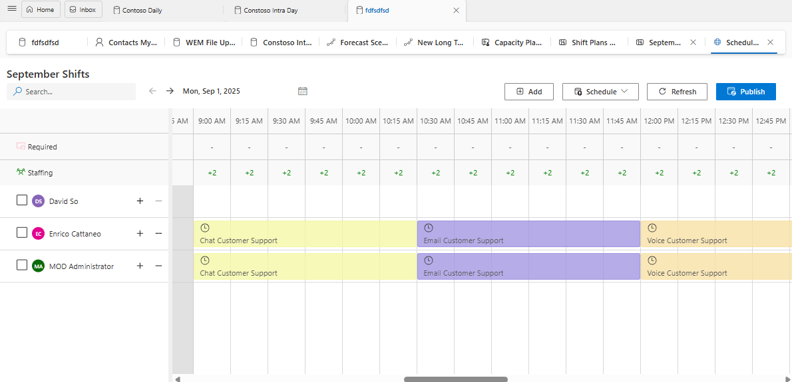

## Task 02: Schedule customer service representatives

### Introduction
Once the shift plan exists, Contoso must assign the correct people to the plan so coverage matches demand and schedules become actionable for supervisors and agents.

### Description
In this task, you'll manually schedule customer service representatives into the shift plan, using both full-plan assignments and date-range assignments to reflect different availability windows.

### Success criteria
- Representatives are successfully scheduled into the shift plan and bookings appear on the schedule board as expected.

### Key steps

1. On the shift plan page, on the command bar, select **Schedule people**.

    

1. On the command bar that appears at the bottom of the page, select **All**.

    

1. Select your administrative account.

    

1. Select **Add**.

1. Set **Add to entire shift plan** to **On**. 

1. Select **Save**. After a short period of time, your new bookings will appear in the shift plan.

    

1. On the shift plan page, on the command bar, select **Schedule people**.

    

1. On the command bar that appears at the bottom of the page, select **All**.

    

1. Select **Enrico Cattaneo** and then select **Add**.

1. Set **Add to entire shift plan** to **Off**. 

1. Configure the fields as follows:

    - **Start date:** 9/15/2025
    - **End date:** 9/26/2025

    

1. Select **Save**. After a short period of time, your new bookings will appear in the shift plan.

    