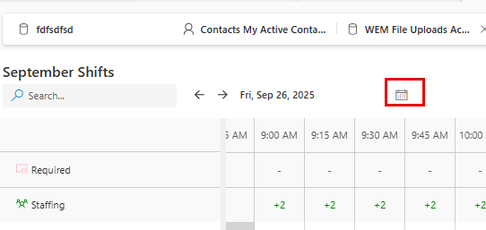
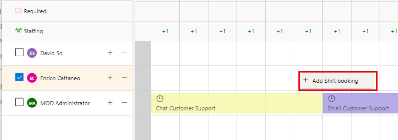
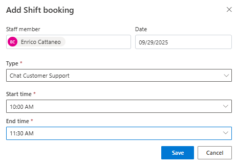
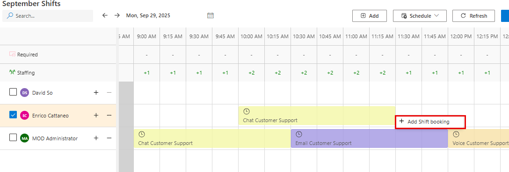
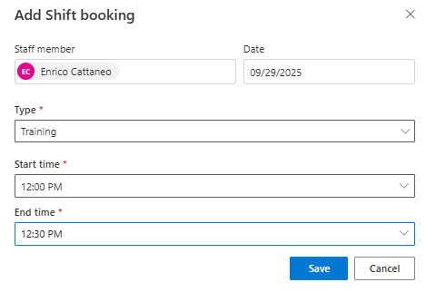

## Task 03: Add extra bookings

### Introduction

Unexpected demand spikes and operational changes require quick schedule adjustments without rebuilding the entire plan.

### Description
In this task, you'll add an extra shift booking for a representative by inserting additional scheduled activities on a specific date and time.

### Success criteria
- Additional shift bookings are created for the selected representative and display correctly on the schedule board.

### Key steps

1. Open the **Sept Shift plan** calendar.

1. At the top of the **Calendar**, select the **Date** selector.

    

1. Select the **29th**.

1. Go to the **10: AM** time slot for Enrico.

1. Right-click the time slot and then select **Add Shift Booking**.

    

1. Configure the fields as follows:

    - **Staff member**: Enrico (Or Similar)
    - **Date:** The 29th of the current month - Ex. 9.29.2025
    - **Type:** Chat Customer Support
    - **Start Time:** 10:00 AM
    - **End time:** 11:30 AM

    

1. Select **Save**.

1. Go to the **12:00 PM** time slot for Enrico.

1. Right-click the time slot and then select **Add Shift Booking**.

    

1. Configure the fields as follows:

    - **Staff member**: Enrico
    - **Date:** 9.29.2025
    - **Type:** Training
    - **Start Time:** 12:00 PM
    - **End time:** 12:30 PM
    

1. Select **Save**.
