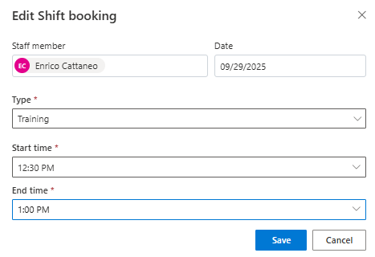

## Task 04: Edit and delete existing shift bookings

### Introduction

Supervisors need the ability to correct scheduling changes quickly, whether it's moving an activity window or removing it entirely.

### Description

In this task, you'll edit an existing shift booking to update its time and then delete a booking to demonstrate schedule maintenance.

### Success criteria
- A shift booking is successfully edited and then deleted, with the schedule board reflecting both changes

### Key steps
1.  On the schedule board, right-click the **Training** booking you just created.

1. Select **Edit Shift booking**.

1. Edit the fields as follows:

    - **Staff member**: Enrico
    - **Date:** the 29th of the current month - Ex: 9.29.2025
    - **Type:** Training
    - **Start Time:** 12:30 PM
    - **End time:** 1:00 PM

    

1. Select **Save**.

1. To delete the **Training booking**, right-click the booking and then select **Delete**.
