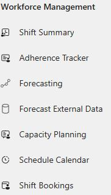
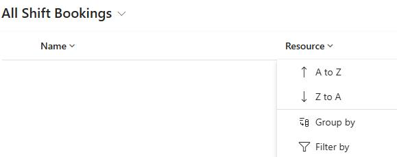
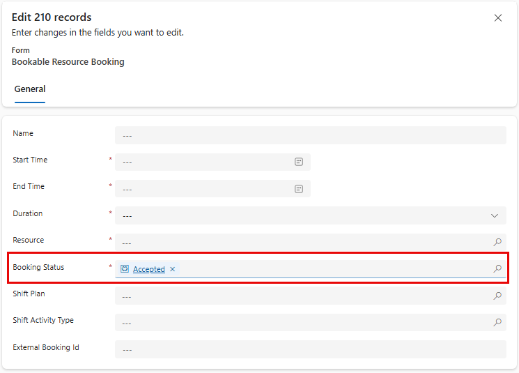

## Task 06: Accept bookings

### Introduction
To ensure schedules appear promptly and consistently for agents, Contoso may need to bulk-confirm bookings so they reflect as accepted on calendars.

### Description
In this task, you'll filter shift bookings for a specific resource, bulk edit them and update the booking status to Accepted.

### Success criteria
- Shift bookings for the selected resource are updated to Accepted in bulk and reflect the new status.

### Key steps
1. In **Copilot Service workspace**, in the left pane, in the **Workforce management** group, select **Shift Bookings**.

    

1. Select the **Resource** column and then select **Filter by**.

    

1. Enter the name of your administrative account and then select **Apply**.

1. Select all shift bookings.

1. On the command bar, select **Edit**.

1. In the **Booking Status** field, select **Accepted**.

    

1. Select **Save**.