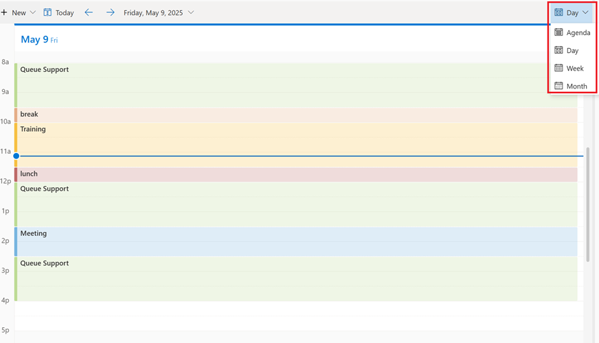

## Task 04: Demo scheduling features

### View the calendar

1. In the **Copilot Service workspace** app, schedule **Calendar** under **Workforce Management**.

1. Use the top-right menu to change the view to Agenda, Day, Week, or Month.

1. Show the Calendar view of a service representative's schedule with the menu to change views expanded.

    

---

### Use auto scheduling

1. Using the navigation on the left, select **Shift planning** under **Workforce Management.**

1. Select the shift plan you want to use to book the representatives, and then select Schedule people on the task bar. The shift scheduler board appears.

1. Select the **Schedule** dropdown menu, and then select **Auto-Schedule**. The **Auto-Schedule Criteria** pane appears.

1. For **Duration**, select the start and end dates for the activity.

1. Set the filters for **Agent availability**, Match **Skills**, and **Match Queue** as required.

1. Set the availability order to either Most Available to Least or Least Available to Most.

1. Select **Schedule**. The schedule board updates and populates the activities for the agents in the activity itinerary.

1. Select **Publish**.

---

### Use shift bidding

1. In the site map of **Copilot Service workspace**, select **Request Management** under **Workforce Management**.

1. Select **New**, and then select **Shift Bid**.

1. On the **Shift Plan To Bid** card, select the shift plan you want to bid on.

1. Review the bid request details, and then select **Save**.

---

### Create a shift swap request

1. In the site map of **Copilot Service workspace**, select **Request** Management under Workforce Management.

1. Select New, and then select **Shift Swap** from the dropdown menu. The New WEM Request page appears.

1. On the Select shift card, enter the details as follows:

    - **Date:** Select the date for the shift you want to swap.

    - **Shift Plan:** Select the name of the plan you want to use for the swap.

    - Full shift day: If you want the entire shift to be included in the swap, set Full shift day to Yes.

    - **Booking:** For a shift swap that doesn't include the entire shift, select the activity to swap. The form populates the Start Time and End Time for the booking and calculates the hours.

    - **Note:** Type a note if desired.

1. On the **Select shift to swap** card, then enter your **Availability date** and **Preferred time range** so that others know when you're available to swap a shift.

1. If you want the system to notify all representatives who meet your availability criteria, toggle on **Public Post**. If the setting is off, the system lists other representatives' available bookings that can be swapped, and then you can select the shift you want to use and complete the swap.