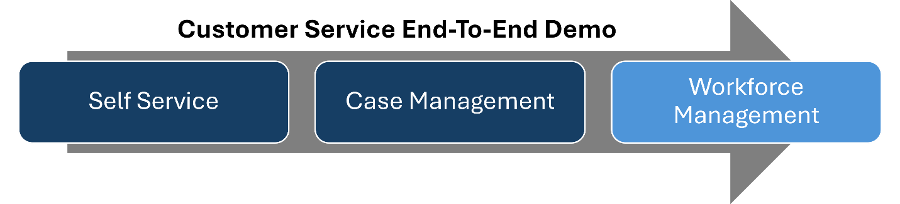

# TechWorkshop L400: Workforce Management

## Where does this fit-in as part of an end-to-end demo?

## Business context

Contoso Coffee stands as one of the leading producers of premium coffee machines in the United States, boasting an extensive clientele that surpasses 5 million with $1 Billion revenue. This customer base is provided with a variety of sophisticated coffee machines, in addition to options for ordering coffee supplies, service agreements, and extended warranties. Contoso caters to both business-to-business (coffee shops) and business-to-consumer (individual buyers) markets.

During Contoso Coffee's seasonal product launch, a surge in customer inquiries about new flavors, water tank maintenance, and warranties exposed major flaws in their workforce management systems; with over 2,000 agents scheduled manually using ServiceNow and Genesys Engage, mismatches between staffing and demand led to long wait times, missed shifts, and compliance risks, while the lack of predictive analytics and real-time scheduling tools caused overstaffing during slow periods and understaffing during peak hours, frustrating customers and burning out agents-all highlighting the urgent need for AI-driven solutions to streamline scheduling, shift swaps, and capacity planning.

## Challenges

Contoso is experiencing significant challenges in managing its global customer service workforce:

- Inconsistent staffing across time zones and seasonal demand fluctuations.

- Manual scheduling processes that are time-consuming and error-prone.

- High agent turnover due to lack of scheduling flexibility and visibility.

- Limited visibility into agent performance and adherence.

- Difficulty forecasting demand during promotions, holidays, and product launches.

- Inability to quickly reallocate resources during unexpected demand surges.

## Why are we talking to Contoso?

Their current approach relies very heavily on manual processes or overly complicated scheduling tools.  The lack of dynamic data makes it difficult to respond quickly to changing customer demand.  They are looking to move away from their current system in ServiceNow to a solution that will help them to modernize its workforce management capabilities and unify its global support operations under a single, intelligent platform.

## Desired outcome breakdown

### Key outcomes:

- Implement AI-driven forecasting to predict contact volumes across channels and regions.

- Automate agent scheduling based on skills, availability, and demand.

- Improve agent satisfaction with self-service shift management tools.

- Monitor real-time adherence and performance metrics.

- Reduce operational costs through optimized staffing and reduced overtime.

### How Dynamics 365 Contact Center helps:

- AI-powered forecasting engine uses historical and real-time data.

- Schedule builder supports multi-skill, multi-time zone optimization.

- Agent portal allows shift bidding, time-off requests, and swaps.

- Real-time dashboards provide supervisors with adherence and productivity insights.

- Integration with HR systems ensures up-to-date agent availability and compliance.

## Learning Objectives

Upon successful completion of this lab, you'll:

- Enable Workforce Management in Dynamics 365 Contact Center.

- Configure the necessary supporting components.

- Create and manage forecasts using historical and imported data.

- Build and publish optimized schedules.

- Configure and demonstrate agent self-service features.

Estimated time to complete this workshop: **75-90 minutes**

## Prerequisites 

{: .warning }
> You must complete the required steps in the **TechWorkshop L300 on-demand: Sales & Service MDX Setup** lab before you start this lab. This ensures that your environment is configured properly and includes all resources that are required to support this lab.

